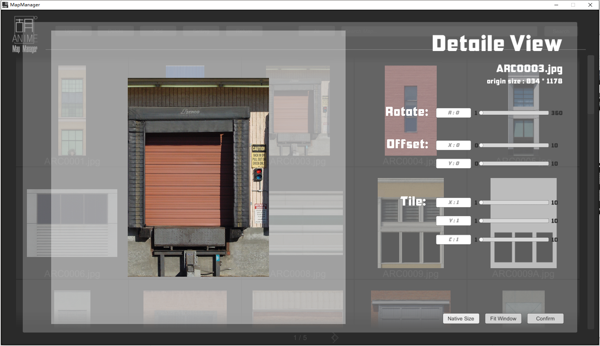

# MapManager
A tool to manage your textures easily

 

  
## ScreenShots
  

  
## How To Use

First, open the MapManager, then click 'Add Gallery' button or click '+' icon; 
 

Enter a name for the newly added gallery, and click 'Ok'; 
 

Now you can see your gallery, put your mouse on its name and you will be able to delete the gallery; 
 

Click the preview image of one gallery to open it, then you can click the 'Add' button to add your textures here by choosing a folder; 
 

Next, click the 'Update' button, MapManager will automatically scan all the texture files in the folder and its sub folder. If there are too many pictures and you don't want to wait for a long time, you can click 'Abort' to terminating the update. MapManager can still allow you to preview the part pictures that has been imported; 
 
 

Click a thumbnail in the gallery can open the Detail View. Here the mouse wheel can zoom in and out the picture, and hold the left key can drag the picture; If the picture is deformed, click the Native Size button to reset it; 
 
  

Clicking the file name of the picture, you can copy this picture to your project folder, which will not affect the source of your picture; 
 

You can search maps in the top right corner. A fuzzy matching result will be displayed while searching is complete. You can click the 'All' button to re-display all the maps; 
 

If you see the following preview, it means that the format of this picture is not supported. But these pictures can be exported as well. The format supported now is 'jpg/png/bmp', more formats will be supported in the future. 
  

---

Thanks for your use, email me if you encountered any problem.

Welcome to visit my homepage: [huanime.com.cn](huanime.com.cn).
